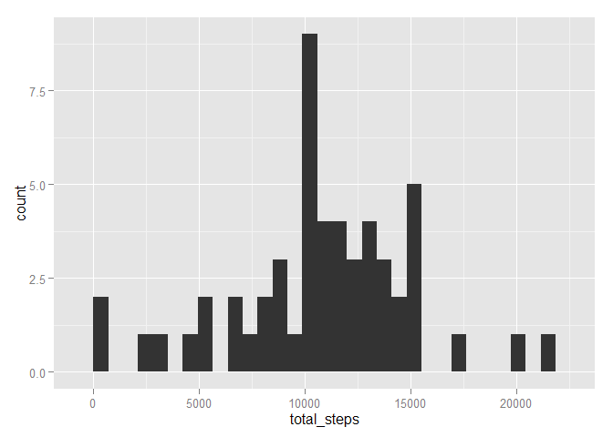
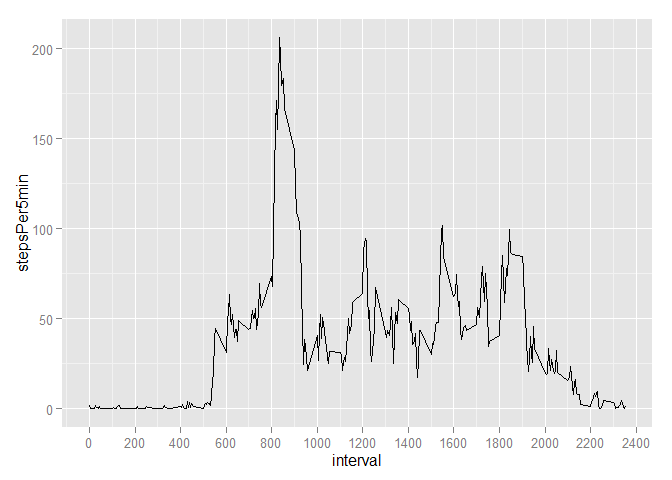
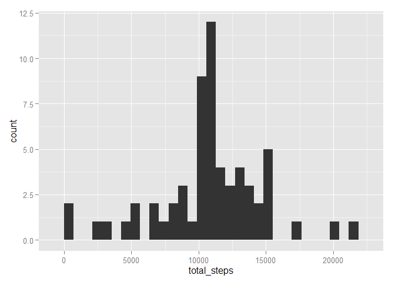
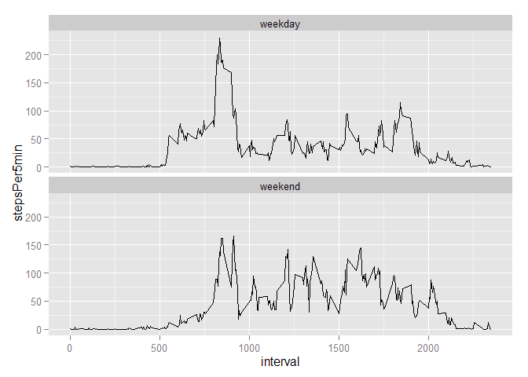

# Reproducible Research: Peer Assessment 1

###Loading and preprocesing data
Data is loaded and "date" column format is updated form "factor" to "date"


```r
library(dplyr)
```

```
## 
## Attaching package: 'dplyr'
## 
## The following object is masked from 'package:stats':
## 
##     filter
## 
## The following objects are masked from 'package:base':
## 
##     intersect, setdiff, setequal, union
```

```r
library(ggplot2)

activity <- read.csv("activity.csv")
activity <- mutate(activity,date = as.character(date))
activity <- mutate(activity,date = as.Date(date,"%Y-%m-%d"))
```
###What is the mean total number of steps taken per day?
1. Calculate the total number of steps taken per day. We have NA in data for several days, thus some of the days have no data available against it.
2. Histogram of total number of steps taken each day. Days with data not available will not get plotted.

```r
bd <- summarise(group_by(activity,date),total_steps = sum(steps))
qplot(total_steps, data=bd,geom="histogram")
```

```
## stat_bin: binwidth defaulted to range/30. Use 'binwidth = x' to adjust this.
```

 

3. Calculation for mean and median of the total number of steps taken per day. NA values have been excluded from calculation

```r
mean(bd$total_steps,na.rm=T)
```

```
## [1] 10766.19
```

```r
median(bd$total_steps,na.rm=T)
```

```
## [1] 10765
```
###What is the average daily activity pattern?
1. Time series plot of average number of steps taken per 5 min.

```r
stepsByTime <- summarise(group_by(activity,interval),stepsPer5min = mean(steps,na.rm=T))
ggplot(stepsByTime, aes(interval,stepsPer5min)) + geom_line() +
   scale_x_continuous(breaks = round(seq(0,2500,200),1))
```

 

2. The 5 min interval which has highest average steps taken per 5 min.

```r
stepsByTime[stepsByTime$stepsPer5min ==max(stepsByTime$stepsPer5min),]
```

```
## Source: local data frame [1 x 2]
## 
##   interval stepsPer5min
## 1      835     206.1698
```

###Imputing Missing Values
1. Total number of missing values in the dataset.

```r
 sum(is.na(activity))
```

```
## [1] 2304
```

2. Replace the missing value for each interval by median of that time inverval over all days 
3. New dataset "ai" has all the missing data from original dataset "activity" filled in with median for each 5 min. interval 


```r
ai <- activity
mi <- summarise(group_by(activity,interval),msteps = mean(steps,na.rm=T))
for(i in seq_along(mi$interval))
  {
   ai[(is.na(ai$steps)) & (ai$interval == mi$interval[i]),"steps"]  <- mi[mi$interval==mi$interval[i],"msteps"] 
}
```
4. Histogram for total number of steps taken each day and calculation for the mean and median, for the newly created dataset with missing values imputed.

```r
bd2 <- summarise(group_by(ai,date),total_steps = sum(steps))
qplot(total_steps, data=bd2,geom="histogram")
```

```
## stat_bin: binwidth defaulted to range/30. Use 'binwidth = x' to adjust this.
```

 

```r
mean(bd2$total_steps)
```

```
## [1] 10766.19
```

```r
median(bd2$total_steps)
```

```
## [1] 10766.19
```

###Are there difference in activity patterns between weekdays and weekends?
1. Create new factor varaible ("day_factor") with two levels - "weekday" and "weekend" indicating whether a given date is a weekday or weekend day.

```r
ai$day_factor <- weekdays(ai$date)
ai <- mutate(ai,day_factor = ifelse(day_factor %in% c("Saturday", "Sunday"),"weekend","weekday"))
```

2. Make a panel plot containing a time series plot (i.e. type = "l") of the 5-minute interval (x-axis) and the average number of steps taken, averaged across all weekday days or weekend days (y-axis). 


```r
bd3 <- summarise(group_by(ai,interval,day_factor),stepsPer5min = mean(steps))
ggplot(bd3, aes(interval,stepsPer5min)) + geom_line() +
   facet_wrap(~day_factor, nrow=2)
```

 
